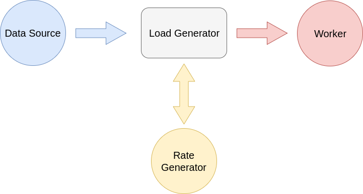
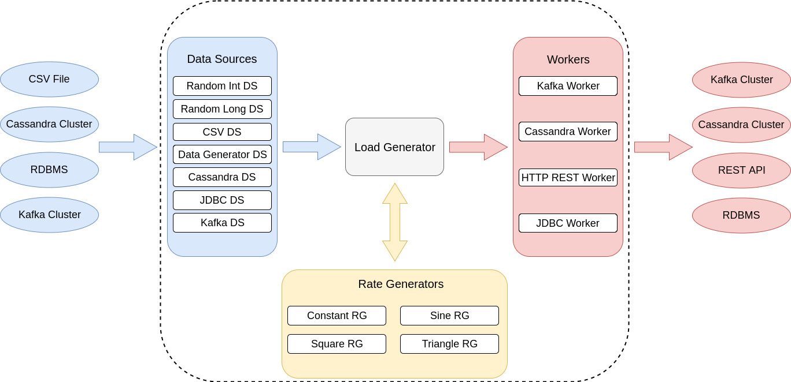

# Ranger

Contextual data and load generator with modular architecture.

[](https://travis-ci.org/smartcat-labs/ranger)
[  ](https://bintray.com/smartcat-labs/maven/ranger/_latestVersion)

## Introduction

Ranger consists of two main separate parts, Data Generator and Load Generator, which can be used stand-alone or can be connected together.

### Data Generator

[Data Generator](ranger-data-generator) allows developers to quickly and in a simple manner define and create large number of objects whose attributes have randomly selected values from the configured set.

It can be used for following:

- quickly populate the database with meaningful values
- create data based on defined rules (e.g. create 100 users out of which 10 have first name 'John' and they are born in 1980) in order to create test data for automated unit and integration tests
- have meaningful data for load testing

### Load Generator

Load Generator is designed to be modular from beginning as illustrated on the following diagram.



Rate generator controls the rate at which load generator operates, rate is expressed on per second basis, or better say, number of impulses which will be generated within one second. Each time impulse is generated load generator fetches data from data source and passes it to worker. Since those are simple interfaces, it is easy to add additional module implementing either data source, worker and even rate generator.
Following diagram represents possible modules for Load Generator of which some are already implemented.



Load generator is designed as command line tool, but having modular architecture makes it easy to use it as Java library as well.

### Ranger Commons

[Ranger Commons](ranger-commons) holds interface for core and configuration and it provides signature all the modules need to confront to be able to work together.

### Ranger Load Generator Core

[Ranger Load Generator Core] contains Load Generator implementation itself and common data source, rate generator and worker implementations.

### Ranger Runner

[Ranger Runner](ranger-runner) represents runnable jar where desired data source, rate generator and worker can be specified within YAML configuration.
Following section illustrates YAML configuration example.

```yaml
load-generator-configuration:
  data-source-configuration-name: DataGenerator
  rate-generator-configuration-name: ConstantRateGenerator
  worker-configuration-name: Kafka

data-source-configuration:
  objectConfiguration:
    fields:
      -
        name: key
        values: Key1,Key2,Key3,Key4,Key5,Key6,Key7,Key8,Key9,Key10
      -
        name: value
        values: Value1,Value2,Value3,Value4,Value5,Value6,Value7,Value8
    numberOfObjects: 10000

rate-generator-configuration:
  rate: 1000

worker-configuration:
  bootstrap.servers: 192.168.1.1:9092,192.168.1.2:9092,192.168.1.3:9092
  topic.name: test-topic
```

Main part of configuration is `load-generator-configuration` where concrete modules which will be used for data source, rate generator and worker need to be specified. After `load-generator-configuration` section, there should be exactly one section for data source, rate generator and worker.
Each section is allowed to contain module specific configuration as configuration interpretation will be done by module itself.
In order for ranger-runner to be able to find particular module, each module jar must be in classpath.

### Modules

List of existing modules:

#### Ranger Load Generator Data Generator

[Ranger Load Generator Data Generator](ranger-load-generator-data-generator) is data source implementation based on data generator.

#### Ranger Load Generator Kafka

[Ranger Load Generator Kafka](ranger-load-generator-kafka) is worker implementation which sends messages to Kafka cluster.

### Usage

Load generator can be used either as a library or as a stand-alone command line tool.

#### Library usage

Artifact can be fetched from bintray.

Add following `repository` element to your `<repositories>` section in `pom.xml`:

```xml
<repository>
  <id>bintray-smartcat-labs-maven</id>
  <name>bintray</name>
  <url>https://dl.bintray.com/smartcat-labs/maven</url>
</repository>
```

Add the `dependency` element to your `<dependencies>` section in `pom.xml` depending which `artifact` and `version` you need:

```xml
<dependency>
  <groupId>io.smartcat</groupId>
  <artifactId>artifact</artifactId>
  <version>version</version>
</dependency>
```

#### Command line tool usage

Download [Ranger Runner](https://bintray.com/smartcat-labs/maven/download_file?file_path=io%2Fsmartcat%2Franger-runner%2F0.0.5%2Franger-runner-0.0.5.jar).

Run following command: `java -jar ranger-runner-0.0.5.jar -c <path_to_config_file>`

For more info on configuration file, see [Ranger Runner](#ranger-runner) section.
