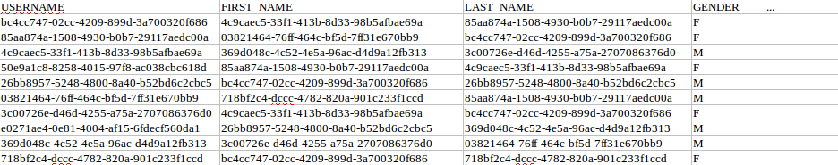
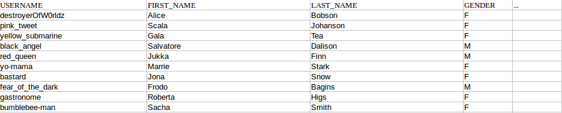

[](https://travis-ci.org/smartcat-labs/ranger)
[  ](https://bintray.com/smartcat-labs/maven/ranger/_latestVersion)

# Ranger

Ranger is a Java open source library that allows developers to quickly and in a simple manner define and create large number of objects whose attributes have randomly selected values from the configured set.

Two main purposes of Ranger are:

- create unit and integration test data based on defined rules
- data source for [Berserker](https://github.com/smartcat-labs/berserker)

Ranger can be also used as data source for a custom tool of your choice.

# Quick guide

Quick guide provides a way to have running Ranger example within 5 minutes from which you can start and build solution for your own needs.
Please take a look at [API documentation](#api) for more details what can be acomplished with Ranger.

## Repository

Artifact can be fetched from bintray.
Add following `<repository>` element to your `<repositories>` section in `pom.xml`:

```xml
<repository>
  <id>bintray-smartcat-labs-maven</id>
  <name>bintray</name>
  <url>https://dl.bintray.com/smartcat-labs/maven</url>
</repository>
```

## Dependency

Add the `<dependency>` element to your `<dependencies>` section in `pom.xml` with specific `version.ranger` you need:

```xml
<dependency>
  <groupId>io.smartcat</groupId>
  <artifactId>ranger</artifactId>
  <version>${version.ranger}</version>
</dependency>
```

Similarly, dependency can be added to any other build tool supporting maven dependencies.

## Code

Copy the code and run it.

___Example.java___
```java
import static io.smartcat.ranger.BuilderMethods.*;

import java.text.ParseException;
import java.text.SimpleDateFormat;
import java.util.Date;

import io.smartcat.ranger.ObjectGenerator;
import io.smartcat.ranger.ObjectGeneratorBuilder;

public class Example {

    private static final SimpleDateFormat DATE_FORMAT = new SimpleDateFormat("yyyy-MM-dd");

    public static void main(String[] args) throws ParseException {
        ObjectGenerator<Address> address = new ObjectGeneratorBuilder()
                .prop("city", random("New York", "Washington", "San Francisco"))
                .prop("street", random("2nd St", "5th Avenue", "21st St", "Main St"))
                .prop("houseNumber", random(range(1, 55))).build(Address.class);

        Date januaryFifth1985 = DATE_FORMAT.parse("1985-01-05");
        Date decemberTwentySecond2000 = DATE_FORMAT.parse("2000-12-22");

        ObjectGenerator<User> user = new ObjectGeneratorBuilder()
              .prop("id", circular(range(1L, 2_000_000L), 1L))
              .prop("username", string("{}{}", random("aragorn", "johnsnow", "mike", "batman"), random(range(1, 100))))
              .prop("firstName", random("Peter", "Rodger", "Michael"))
              .prop("lastName", random("Smith", "Cooper", "Stark", "Grayson", "Atkinson", "Durant"))
              .prop("birthDate", random(range(januaryFifth1985, decemberTwentySecond2000)))
              .prop("maried", false)
              .prop("accountBalance", random(range(0.0d, 10_000.0d)))
              .prop("address", address).build(User.class);

        for (int i = 0; i < 100; i++) {
            System.out.println(user.next());
        }
    }

    private static class Address {

        public String city;
        public String street;
        public long houseNumber;

        @Override
        public String toString() {
            return "Address [city=" + city + ", street=" + street + ", houseNumber=" + houseNumber + "]";
        }
    }

    private static class User {

        public long id;
        public String username;
        public String firstName;
        public String lastName;
        public Date birthDate;
        public boolean maried;
        public Double accountBalance;
        public Address address;

        @Override
        public String toString() {
            return "User [id=" + id + ", username=" + username + ", firstName=" + firstName + ", lastName=" + lastName
                    + ", birthDate=" + birthDate + ", maried=" + maried + ", accountBalance=" + accountBalance
                    + ", address=" + address + "]";
        }
    }
}

```

# Why?

Totally random test data is not so useful:



- It is hard to make it by certain rules
- It is hard to reason about it
- It does not reflect production data values nor distribution

What we can do is use contextual data generator and create users whose attribute values make sense in the domain context. We can also say, for example, that 70% of created users should be females. The table will then look like this:



# How it works?

Ranger builds a tree of dependent value generators based on user configuration (either Java API or YAML configuration). Then it uses that tree
to construct map with generated values. If type is not specified by builder or configuration parser, `Map<String, Object>` is return type. If type is specified, Jackson library is used to convert map to specified type. All rules and limitations of Jackson apply here also.

# API

Ranger supports two ways of configuring generator. [Java API](java-api.md) and [YAML Configuration](yaml-configuration.md).

# Examples

All examples are located at [src/example/java](src/example/java).
